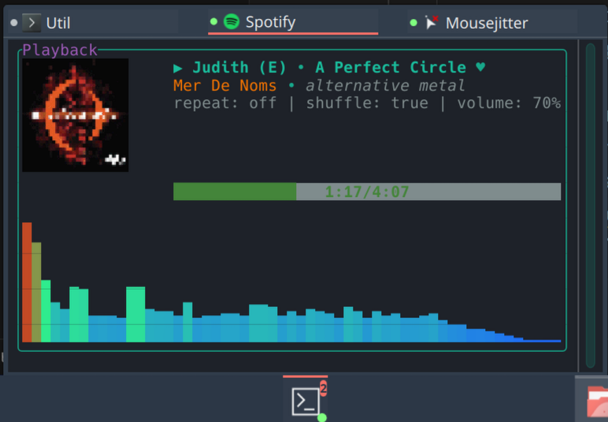

# Termibar



KDE Plasma 6 plasmoid that pins TUI applications to your panel. Close the popup, the process keeps running. Reopen it, you're right where you left off.

## Features

- Multiple terminal tabs in a single widget
- Per-tab commands — run spotify_player, htop, or any TUI
- Processes survive popup close/open cycles
- Per-tab autostart with panel
- Native KDE icon and font pickers in settings
- Live config updates without restart

## Dependencies

### Runtime

- KDE Plasma 6 (>= 6.0)
- Qt 6 (>= 6.8)
- `konsole-kpart` — Konsole terminal KPart plugin

### Build

```bash
# Debian/Ubuntu
sudo apt install qt6-declarative-dev extra-cmake-modules libkf6parts-dev

# Fedora
sudo dnf install qt6-qtdeclarative-devel extra-cmake-modules kf6-kparts-devel

# Arch
sudo pacman -S qt6-declarative extra-cmake-modules kparts
```

## Install

```bash
git clone https://github.com/ekats/termibar.git
cd termibar
./install.sh
```

The install script builds the C++ plugin, installs it to the system Qt QML path (requires sudo), installs the plasmoid, and restarts plasmashell.

After install, right-click your panel → Add Widgets → search "Termibar".

## Update

```bash
./install.sh
```

Same script handles updates.

## Known Limitations

- Terminal cursor renders hollow (Wayland focus model mismatch — typing works fine)
- Konsole KPart inherits Konsole's profiles and color schemes

## License

AGPL-3.0
